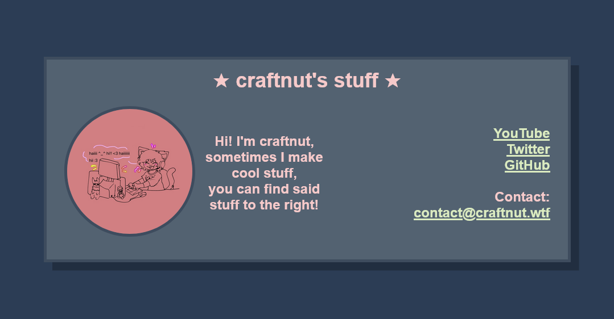
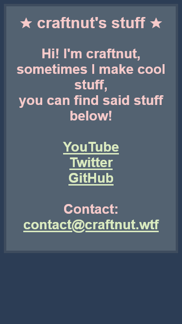

# CraftSiteV3
## My simple link + info website

    Feel free to use my website as a template for your own,  
    Please credit me somewhere on your site with a link to <a href="https://github.com/craftnut/CraftSiteV3">https://github.com/craftnut/CraftSiteV3</a> or <a href="https://craftnut.wtf/CraftSiteV3">https://craftnut.wtf/</a> if you do!

## Some screenshots
-------------------

On desktops, the site looks like this:  

  

When you load on mobile, detectMobile.js redirects you to the mobile page:  

  

